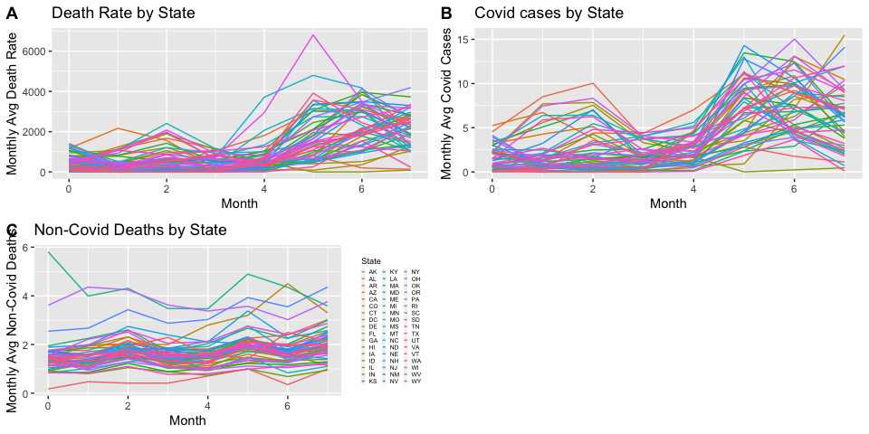
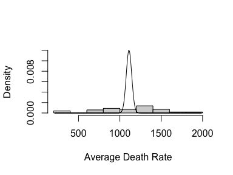
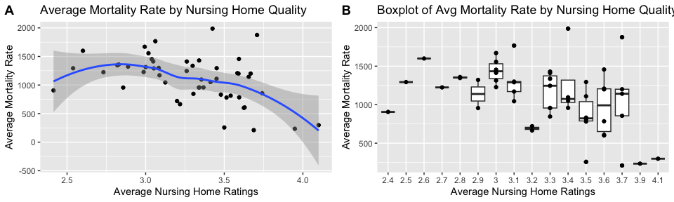
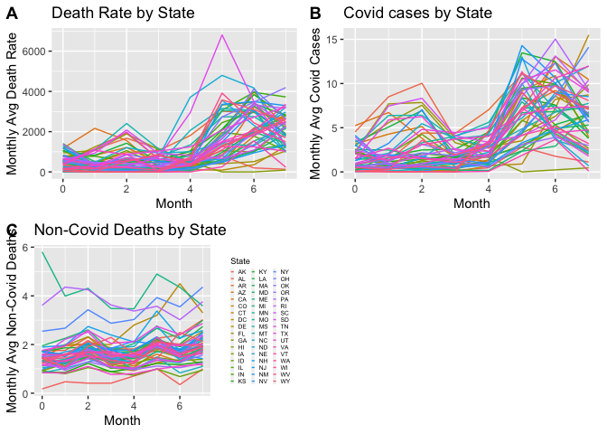
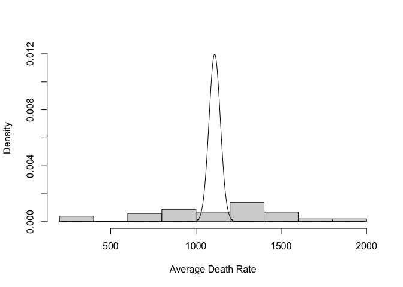
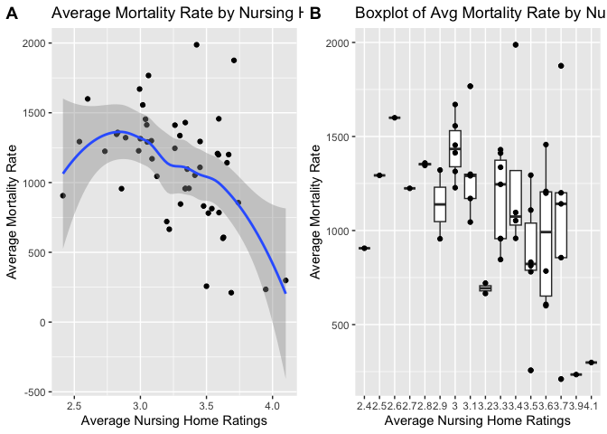

BST260 Final Project: Understanding COVID-19 Moratality Rates of Nursing
Homes in the US
================
Stella Nam

# Introduction

Over the past three years, the COVID-19 pandemic has affected the lives
of millions worldwide. Although the global burden exists everywhere, the
negative impact it has had on the senior population, especially those
individuals residing in nursing homes, has been detrimental$^1$. It is
critical to understand how and why so many senior residents in these
homes lost their lives to the pandemic in order to implement prevention
measures for this ongoing COVID-19 pandemic and for future outbreaks.
This project investigated the effect of the quality of nursing homes on
the number of COVID-19-related deaths in the US while controlling for
geographic and socioeconomic factors. The quality of the residence was
derived from the Centers for Medicare & Medicaid Services (CMS) 5-star
quality rating system, a standardized measure created by the US federal
agency$^2$.

The Nursing Home COVID-19 database in the US has been released on May
26, 2020. Since then, the database has been updated weekly by the
CMS$^3$. The data retained in this data set is from June 1, 2020 to
January 31, 2021 (an 8-month period) with information on nursing homes
from all states except Guam and Puerto Rico. Over the months of data
collection, the data set has 99,314 observations of 24 variables related
to the nursing home, the local COVID-19 situation, and geographic
determinants.

The main outcome of the data set, mortality date in nursing homes, as
well as variables that are directly related to the main outcome
(COVID-19 cases and non-COVID-related death cases in nursing home
residents), were visualized to further understand the data set. The
changes in COVID-19 cases per month seem to be following a trend
proportional to the overall death rate in nursing homes. Additionally,
different states reported varying levels of cases and deaths, but most
states seem to be following the same trends over time (Fig. 1a, 1b).
Therefore, it was not necessary to study a month-by-month difference in
the death rates since most states appeared to follow the same trends.
Rather, examining the overall difference during the entire 8-month study
period to compare the state-by-state differences in nursing homes seems
like a more appropriate approach for this data set. Additionally, the
number of non-COVID-related deaths in nursing homes tend to stay
relatively constant over the study period (Fig. 1c). Therefore, using
the overall death rate in nursing homes was deemed as an accurate method
for studying COVID-related mortality rates in nursing homes without
further data reshaping for specifically the main outcome.

Since the original data set has information on each nursing home with
each month being an entry, the data needs to be extensively reshaped to
fit the research questions of this project. The month-by-month
comparison needs to be averaged together as well as all the nursing home
data by state. Moreover, certain predictors that do not align with the
research question or cannot be properly analyzed using averaged data
were omitted. After data wrangling, a Poisson regression model is
employed to estimate the COVID-19 mortality rates in nursing homes from
our data. To account for overdispersion, an extension of the Poisson
model, the Negative Binomial regression, was used to prevent
overconfident estimates. No further modifications were made to the data
set to perform a Negative Binomial regression because the data was
already in counts and rate form.

**Figure 1:**

<!-- -->

# Results (Route 1)

***Data wrangling***

The original data set was organized such that each row entry was for a
nursing home in the US at each month of the study period. Therefore,
there were 99,314 row entries of 12415 different senior homes across the
US (Table 1). This data was not tidy. Additionally, it was not useful
for studying state-by-state differences over the entire study period.
Therefore, all location-related variables except the state variable was
removed. All the data was grouped for all the data by each month and by
state. Thus, there were 8 row entries for each state with each row
representing a different month in the study period. Upon analysis of the
variations between the study period (refer to Introduction), we decided
to study patterns in mortality rates over the entire study period rather
than at different time points. Hence, the data was further reshaped to
display the overall averaged values for each state over the entire study
period. All data from the Core Based Statistical Area (CBSA) were
removed as they were not relevant for a state-by-state averaged study
since CBSA data would be more useful for the individual, within-state
research questions. Therefore, the final data set for our analysis
contained 51 row entries (one for each state), 1 variable for the main
outcome (mortality rate), and 10 potential predictors of the main
outcome (Table 2).

**Table 1: Original Data Set**

    ## # A tibble: 6 × 24
    ##   providername   provi…¹ provi…² provi…³ provi…⁴ provz…⁵ RES_M…⁶ S_STA…⁷ S_PPE…⁸
    ##   <chr>          <chr>   <chr>   <chr>     <dbl> <chr>     <dbl>   <dbl>   <dbl>
    ## 1 EVENTIDE AT S… 125 13… WEST F… ND        58078 58078        18       0       0
    ## 2 SUNNYVALE POS… 1291 S… SUNNYV… CA        94087 94087         0       0       0
    ## 3 CENTINELA SKI… 950 FL… INGLEW… CA        90301 90301         1       0       0
    ## 4 BAKER-KATZ SK… 194 BO… HAVERH… MA         1830 01830         4       0       0
    ## 5 MONARCH MEADO… 299 CO… SEAMAN  OH        45679 45679         0       0       0
    ## 6 CONSOLATA HOME 2319 E… NEW IB… LA        70560 70560         0       4       0
    ## # … with 15 more variables: RES_Monthlyalldeaths_excptCOV <dbl>,
    ## #   overall_rating <dbl>, paymcaid_num <dbl>, pctwhite_2011pN <dbl>,
    ## #   vulnerabilityindex_county <dbl>, CBSACode <chr>, casesper100k_CBSA <dbl>,
    ## #   deathsper100k_CBSA <dbl>, NH_deathsper100k <dbl>, ownership_recode <dbl>,
    ## #   facility_size <dbl>, urban_rural <dbl>, month_final <dbl>,
    ## #   lnCBSAdeathRate <dbl>, lnCBSAcaseRate <dbl>, and abbreviated variable names
    ## #   ¹​provideraddress, ²​providercity, ³​providerstate, ⁴​providerzipcode, …

**Table 2: Wrangled Data Set only including the first 6 variables**

    ## # A tibble: 6 × 12
    ##   state NH_dea…¹ RES_M…² RES_M…³ S_STA…⁴ S_PPE…⁵ overa…⁶ paymc…⁷ pctwh…⁸ vulne…⁹
    ##   <chr>    <dbl>   <dbl>   <dbl>   <dbl>   <dbl>   <dbl>   <dbl>   <dbl>   <dbl>
    ## 1 AK        211.   0.868   0.566  1.54     0.662    3.69   NaN     NaN     0.499
    ## 2 AL       1336.   7.29    2.14   1.73     0.989    3.30    66.9    75.8   0.559
    ## 3 AR       1670.   5.81    1.50   0.797    0.303    2.99    66.0    83.6   0.602
    ## 4 AZ       1457.   5.22    1.58   0.802    0.704    3.59    52.8    74.3   0.504
    ## 5 CA       1096.   5.41    1.28   0.0957   0.517    3.35    59.4    59.5   0.557
    ## 6 CO       1142.   3.49    1.62   0.926    0.865    3.66    63.0    80.7   0.410
    ## # … with 2 more variables: facility_size_mean <dbl>, urban_rural_mean <dbl>,
    ## #   and abbreviated variable names ¹​NH_deathsper100k_mean,
    ## #   ²​RES_MonthlyconfC19cases_mean, ³​RES_Monthlyalldeaths_excptCOV_mean,
    ## #   ⁴​S_STAFF_ANY_mean, ⁵​S_PPE_ANY_mean, ⁶​overall_rating_mean,
    ## #   ⁷​paymcaid_num_mean, ⁸​pctwhite_2011pN_mean, ⁹​vulnerabilityindex_county_mean

***Analysis: Poisson Regression***

Overdispersion:

As a model specialized for count data, we employed a Poisson regression.
Although the Poisson density roughly fits each of our potential target
variables, they are overdispersed because the variance is greater than
the mean (nursing home death rate: mean of 1110.511 deaths/100,000
residents and variance of 160259.1 deaths$^2$/100,000 residents$^2$ over
the 8-month study period (Fig. 2). The presence of overdispersion
suggest the use of a Poisson model extension, rather than the standard
Poisson model itself. With a lack of zero-inflated data, we employ a
Negative Binomial regression, which should account for overdispersion,
to make sure we do not have overconfident estimates. For these data, we
do not need to account for lag as they are all averaged over the same
time period for each predictor and outcome variable, respectively.

**Figure 2: Average Covid-19 Death Rate Density Distribution**

<!-- -->

Correlation:

The main outcome is death rate (NH_deathsper100k_mean) and the main
predictor is nursing home quality (overall_rating_mean). We want to
understand how correlated the two variables are in order to get a better
grasp of how nursing home quality is related to COVID-19 death rates.

Based on the plots below, there is a lot of variation between the main
predictor and outcome from the large scatter (Fig. 3). However, there is
a downward trend where the higher the nursing home rate, the lower the
mortality rate among the residents. This is confirmed by the correlation
coefficient (R = -0.4471934), which suggests that the variables are
roughly negatively correlated. This implies that there is some
relationship that should be further studied along with other potential
predictors of mortality rate in these nursing homes.

**Figure 3:**

<!-- -->

Model Fit:

The negative binomial model with just the main predictor (nursing home
quality) with a mortality rate as the outcome had a relatively high AIC
value of 763.81 despite the predictor being significant (p-value \<
0.05). We then adjusted for the number of COVID-19 cases in the nursing
home since there was some variability observed from the exploratory data
analysis (refer to Introduction). Additionally, the COVID-19 cases in
nursing home residents could be a potential confounder since it is could
be associated with both the outcome (death rate) and main predictor
(nursing home quality), but is not a downstream consequence of the main
predictor. This decreased the AIC value to 756.01, thus suggesting an
improved model fit for our data, however, the main predictor was no
longer significant. Therefore, we checked for effect modification of
COVID-19 cases on the main predictor effect on the main outcome. We
observed effect modification with an improved model fit upon including
the interaction term. Similarly, we controlled for nursing home size,
staff shortages, and PPE shortages for the same reason of potential
confounding while checking for effect modification. As a result, we had
an improved model with an AIC value of 729.36.

Moreover, we controlled for socioeconomic factors like the percentage of
white residents in the facility and the percentage of Medicaid residents
in the facility since they can be determinants of the death rate.
However, we did not control for whether the average nursing home was
more urban or rural since the variable in the source data set was binary
(0 for rural and 1 for urban). Our data were averaged over a large
sample size for this binary operator and thus were not deemed to be
effective at suggesting whether the homes were more rural or urban on
average. Similarly, we did not adjust for the CDC social vulnerability
index for the same reason of being a binary predictor averaged over a
large sample size. (Note: detailed step-by-step analysis of the model
fit can be found in the Appendix.)

Therefore, we derive our final model (Table 3).
$$log(E[Y_i = mortality rate | X_j] = \beta_0 + \beta_1X_1+…+\beta_pX_p$$

**Table 3: Fitted Negative Binomial regression model summary**

    ##                                                     Estimate  Std. Error
    ## (Intercept)                                      12.61231037 1.267100657
    ## overall_rating_mean                              -1.51345882 0.370940292
    ## RES_MonthlyconfC19cases_mean                     -0.79249801 0.299277799
    ## facility_size_mean                               -0.48621313 0.124774616
    ## S_STAFF_ANY_mean                                  0.17865175 0.077730591
    ## paymcaid_num_mean                                -0.01319791 0.005816746
    ## overall_rating_mean:RES_MonthlyconfC19cases_mean  0.29497492 0.088035770
    ##                                                    z value     Pr(>|z|)
    ## (Intercept)                                       9.953677 2.430344e-23
    ## overall_rating_mean                              -4.080060 4.502399e-05
    ## RES_MonthlyconfC19cases_mean                     -2.648035 8.096121e-03
    ## facility_size_mean                               -3.896731 9.749976e-05
    ## S_STAFF_ANY_mean                                  2.298345 2.154213e-02
    ## paymcaid_num_mean                                -2.268950 2.327136e-02
    ## overall_rating_mean:RES_MonthlyconfC19cases_mean  3.350626 8.062920e-04

Note that “estimate” is equivalent to a $\beta$ value.

An AIC value of 685.11, the lowest value of all the other models we have
explored, leads us to believe that it is the best-fit model of the
models we have considered. Additionally, we find that the negative
binomial regression has slightly higher standard errors and resulting
test statistics compared to the standard Poisson regression. This is as
we expected since it suggests that the standard Poisson regression may
cause overconfidence in model evaluations, due to the property of E\[Y\]
= Var(Y) being unsatisfied.

Furthermore, we can interpret the Negative Binomial regression supposing
nursing home quality is our covariate of interest. For a 1-star increase
in nursing home quality rating, a state has an estimated
$e^{-1.51345882} = 0.2201472$ times the incident rate of mortality rate
in nursing home residents compared to if a state did not have a 1-star
increase in nursing home quality rating, on average, holding all other
covariates (monthly average COVID-19 cases among residents, average
facility size, average staff storage, and average Medicaid resident
percentage) fixed. This was a significant relationship as well,
suggesting that nursing home quality may be negatively associated with
the incidence rate of COVID-19 deaths according to these data.

# Conclusion

Overall, our findings using the negative binomial regression model (an
extension of the Poisson regression model) agree with previous
literature and further elucidate the role of nursing home quality on
COVID-19 mortality rates in nursing homes across the US. Additionally,
other factors such as the severity of the COVID-19 pandemic in the state
and socioeconomic status can influence the mortality rate in senior
homes.

Throughout our model variations, we consistently observe a potential
decrease in COVID-19 mortality rates on average following an increase in
nursing home quality, according to these data. This, combined with the
observation that an increase in staff shortages is associated with a
potential increase in mortality rate suggests that the lack of access to
care personnel such as nurses and clinicians could be potentially
driving worse health outcomes. Interestingly, despite the racial
composition of the nursing homes not significantly altering mortality
rates, a potential decrease in mortality rate was observed as the
percentage of Medicaid residents increased. This further confirms the
impact of socioeconomic influences on the senior population in the US.

If given more time, I would have liked to explore differences in
healthcare access and training of the staff in nursing homes. These
factors could be important predictors for understanding morality rates.
Additionally, updating the data set to contain up-to-date data on the
mortality rates would have been another future direction of interest
given that the COVID-19 pandemic is still an ongoing outbreak.
Understanding how vaccines and the differences in vaccine rollout in the
different states affected the senior population, specifically those
living in nursing homes, could have been interesting to investigate.

# References

1.  Cronin CJ, Evans WN. Nursing home quality, COVID-19 deaths, and
    excess mortality. *J Health Econ*. 2022;82:102592.
    <doi:10.1016/j.jhealeco.2022.102592>

2.  Five-star quality rating system. CMS.
    <https://www.cms.gov/medicare/provider-enrollment-and-certification/certificationandcomplianc/fsqrs>.
    Published December 6, 2022. Accessed December 16, 2022.

3.  Gupta DD, Kelekar U, Turner SC, Sule AA, Jerman TG. Cov-19 deaths
    (monthly) among nursing home residents in the US: June-1, 2020 -
    January-31, 2021. openICPSR.
    <https://www.openicpsr.org/openicpsr/project/147921/version/V1/view?path=%2Fopenicpsr>.
    Published August 20, 2021. Accessed December 16, 2022.

# Appendix

``` r
library(haven)
library(dplyr)
library(tidyr)
library(dslabs)
library(ggplot2)
library(ggpubr)
# the data set:
data <- read_dta('/Users/andy/Downloads/260projectfinal.dta')

########## START OF DATA WRANGLING ################

# remove all location variables except state
data2 <- data[ -c(1:3, 5:6) ]

# subset data into different months when data collected
month_0 = data2 |> filter(month_final == 0) |> rename("month_0" = "month_final")
month_1 = data2 |> filter(month_final == 1) |> rename("month_1" = "month_final")
month_2 = data2 |> filter(month_final == 2) |> rename("month_2" = "month_final")
month_3 = data2 |> filter(month_final == 3) |> rename("month_3" = "month_final")
month_4 = data2 |> filter(month_final == 4) |> rename("month_4" = "month_final")
month_5 = data2 |> filter(month_final == 5) |> rename("month_5" = "month_final")
month_6 = data2 |> filter(month_final == 6) |> rename("month_6" = "month_final")
month_7 = data2 |> filter(month_final == 7) |> rename("month_7" = "month_final")

# merge data for same states-- every variable represents the average value for the respective state
avg_state <- function(month_i) {
  month_i <- month_i[-c(17)]
  month_i |> group_by(providerstate) |> 
    summarize(RES_MonthlyconfC19cases = mean(RES_MonthlyconfC19cases, na.rm = TRUE),
              S_STAFF_ANY = mean(S_STAFF_ANY, na.rm = TRUE),
              S_PPE_ANY = mean(S_PPE_ANY, na.rm = TRUE),
              RES_Monthlyalldeaths_excptCOV = mean(RES_Monthlyalldeaths_excptCOV, na.rm = TRUE),
              overall_rating = mean(overall_rating, na.rm = TRUE),
              paymcaid_num = mean(paymcaid_num, na.rm = TRUE),
              pctwhite_2011pN = mean(pctwhite_2011pN, na.rm = TRUE),
              vulnerabilityindex_county = mean(vulnerabilityindex_county, na.rm = TRUE),
              CBSACode = mean(as.numeric(CBSACode), na.rm = TRUE),
              casesper100k_CBSA = mean(casesper100k_CBSA, na.rm = TRUE),
              deathsper100k_CBSA = mean(deathsper100k_CBSA, na.rm = TRUE),
              NH_deathsper100k = mean(NH_deathsper100k, na.rm = TRUE),
              ownership_recode = mean(ownership_recode, na.rm = TRUE),
              facility_size = mean(facility_size, na.rm = TRUE),
              urban_rural = mean(urban_rural, na.rm = TRUE),
              lnCBSAdeathRate = mean(lnCBSAdeathRate, na.rm = TRUE),
              lnCBSAcaseRate = mean(lnCBSAcaseRate, na.rm = TRUE))
}


# apply function and wrangle these 3 variables (NH_deathsper100k, RES_MonthlyconfC19cases, RES_Monthlyalldeaths_excptCOV) so that we can study their trends 
month_0 <- month_0 |> avg_state() |> mutate(month_0 = 0) |> 
  rename("RES_MonthlyconfC19cases_m0" = "RES_MonthlyconfC19cases", 
         "RES_Monthlyalldeaths_excptCOV_m0" = "RES_Monthlyalldeaths_excptCOV",
         "NH_deathsper100k_m0" = "NH_deathsper100k") 
month_1 <- month_1 |> avg_state() |> mutate(month_0 = 1) |> 
  rename("RES_MonthlyconfC19cases_m1" = "RES_MonthlyconfC19cases", 
         "RES_Monthlyalldeaths_excptCOV_m1" = "RES_Monthlyalldeaths_excptCOV",
         "NH_deathsper100k_m1" = "NH_deathsper100k") 
month_2 <- month_2 |> avg_state() |> mutate(month_0 = 2) |> 
  rename("RES_MonthlyconfC19cases_m2" = "RES_MonthlyconfC19cases", 
         "RES_Monthlyalldeaths_excptCOV_m2" = "RES_Monthlyalldeaths_excptCOV",
         "NH_deathsper100k_m2" = "NH_deathsper100k") 
month_3 <- month_3 |> avg_state() |> mutate(month_0 = 3) |> 
  rename("RES_MonthlyconfC19cases_m3" = "RES_MonthlyconfC19cases", 
         "RES_Monthlyalldeaths_excptCOV_m3" = "RES_Monthlyalldeaths_excptCOV",
         "NH_deathsper100k_m3" = "NH_deathsper100k") 
month_4 <- month_4 |> avg_state() |> mutate(month_0 = 4) |> 
  rename("RES_MonthlyconfC19cases_m4" = "RES_MonthlyconfC19cases", 
         "RES_Monthlyalldeaths_excptCOV_m4" = "RES_Monthlyalldeaths_excptCOV",
         "NH_deathsper100k_m4" = "NH_deathsper100k") 
month_5 <- month_5 |> avg_state() |> mutate(month_0 = 5) |> 
  rename("RES_MonthlyconfC19cases_m5" = "RES_MonthlyconfC19cases", 
         "RES_Monthlyalldeaths_excptCOV_m5" = "RES_Monthlyalldeaths_excptCOV",
         "NH_deathsper100k_m5" = "NH_deathsper100k") 
month_6 <- month_6 |> avg_state() |> mutate(month_0 = 6) |> 
  rename("RES_MonthlyconfC19cases_m6" = "RES_MonthlyconfC19cases", 
         "RES_Monthlyalldeaths_excptCOV_m6" = "RES_Monthlyalldeaths_excptCOV",
         "NH_deathsper100k_m6" = "NH_deathsper100k") 
month_7 <- month_7 |> avg_state() |> mutate(month_0 = 7) |> 
  rename("RES_MonthlyconfC19cases_m7" = "RES_MonthlyconfC19cases", 
         "RES_Monthlyalldeaths_excptCOV_m7" = "RES_Monthlyalldeaths_excptCOV",
         "NH_deathsper100k_m7" = "NH_deathsper100k") 


# ----------------------START OF EDA------------------------
# for some EDA, lets see if there's any intra- or inter-state trends in the covid deaths or cases
##monthly death rate for senior home residents 
month0 <- month_0 |> rename("0" = "NH_deathsper100k_m0") |>
  select(providerstate, "0")
month1 <- month_1 |> rename("1" = "NH_deathsper100k_m1") |>
  select(providerstate, "1") 
month2 <- month_2 |> rename("2" = "NH_deathsper100k_m2") |>
  select(providerstate, "2") 
month3 <- month_3 |> rename("3" = "NH_deathsper100k_m3") |>
  select(providerstate, "3") 
month4 <- month_4 |> rename("4" = "NH_deathsper100k_m4") |>
  select(providerstate, "4") 
month5 <- month_5 |> rename("5" = "NH_deathsper100k_m5") |>
  select(providerstate, "5")
month6 <- month_6 |> rename("6" = "NH_deathsper100k_m6") |>
  select(providerstate, "6") 
month7 <- month_7 |> rename("7" = "NH_deathsper100k_m7") |>
  select(providerstate, "7") 

total <- left_join(month0, month1, by="providerstate")
total <- left_join(total, month2, by="providerstate")
total <- left_join(total, month3, by="providerstate")
total <- left_join(total, month4, by="providerstate")
total <- left_join(total, month5, by="providerstate")
total <- left_join(total, month6, by="providerstate")
total <- left_join(total, month7, by="providerstate")

new_total <- total |> 
  pivot_longer("0":"7", names_to = "month", values_to = "res_death")
# graph cases of residents:
fig1a <- new_total |> ggplot(aes(x = month, y= res_death)) +
  geom_line(aes(x = as.numeric(month), y= res_death, color = factor(providerstate))) +
  labs(x = "Month", y = "Monthly Avg Death Rate", 
              title = "Death Rate by State") +
  theme(legend.position = "none")
##monthly covid cases for senior home residents 
month0 <- month_0 |> rename("0" = "RES_MonthlyconfC19cases_m0") |>
  select(providerstate, "0")
month1 <- month_1 |> rename("1" = "RES_MonthlyconfC19cases_m1") |>
  select(providerstate, "1") 
month2 <- month_2 |> rename("2" = "RES_MonthlyconfC19cases_m2") |>
  select(providerstate, "2") 
month3 <- month_3 |> rename("3" = "RES_MonthlyconfC19cases_m3") |>
  select(providerstate, "3") 
month4 <- month_4 |> rename("4" = "RES_MonthlyconfC19cases_m4") |>
  select(providerstate, "4") 
month5 <- month_5 |> rename("5" = "RES_MonthlyconfC19cases_m5") |>
  select(providerstate, "5")
month6 <- month_6 |> rename("6" = "RES_MonthlyconfC19cases_m6") |>
  select(providerstate, "6") 
month7 <- month_7 |> rename("7" = "RES_MonthlyconfC19cases_m7") |>
  select(providerstate, "7") 

total <- left_join(month0, month1, by="providerstate")
total <- left_join(total, month2, by="providerstate")
total <- left_join(total, month3, by="providerstate")
total <- left_join(total, month4, by="providerstate")
total <- left_join(total, month5, by="providerstate")
total <- left_join(total, month6, by="providerstate")
total <- left_join(total, month7, by="providerstate")

new_total <- total |> 
  pivot_longer("0":"7", names_to = "month", values_to = "res_cases")

# graph cases of residents:
fig1b <- new_total |> ggplot(aes(x = month, y= res_cases)) +
  geom_line(aes(x = as.numeric(month), y= res_cases, color = factor(providerstate))) +
  labs(x = "Month", y = "Monthly Avg Covid Cases", 
              title = "Covid cases by State") +
  theme(legend.position = "none")

##monthly non-covid-related death cases for senior home residents 
month0 <- month_0 |> rename("0" = "RES_Monthlyalldeaths_excptCOV_m0") |>
  select(providerstate, "0")
month1 <- month_1 |> rename("1" = "RES_Monthlyalldeaths_excptCOV_m1") |>
  select(providerstate, "1") 
month2 <- month_2 |> rename("2" = "RES_Monthlyalldeaths_excptCOV_m2") |>
  select(providerstate, "2") 
month3 <- month_3 |> rename("3" = "RES_Monthlyalldeaths_excptCOV_m3") |>
  select(providerstate, "3") 
month4 <- month_4 |> rename("4" = "RES_Monthlyalldeaths_excptCOV_m4") |>
  select(providerstate, "4") 
month5 <- month_5 |> rename("5" = "RES_Monthlyalldeaths_excptCOV_m5") |>
  select(providerstate, "5")
month6 <- month_6 |> rename("6" = "RES_Monthlyalldeaths_excptCOV_m6") |>
  select(providerstate, "6") 
month7 <- month_7 |> rename("7" = "RES_Monthlyalldeaths_excptCOV_m7") |>
  select(providerstate, "7") 

total <- left_join(month0, month1, by="providerstate")
total <- left_join(total, month2, by="providerstate")
total <- left_join(total, month3, by="providerstate")
total <- left_join(total, month4, by="providerstate")
total <- left_join(total, month5, by="providerstate")
total <- left_join(total, month6, by="providerstate")
total <- left_join(total, month7, by="providerstate")

new_total <- total |> 
  pivot_longer("0":"7", names_to = "month", values_to = "res_nonCovidDeath")

# graph cases of residents:
fig1c <- new_total |> ggplot(aes(x = month, y= res_nonCovidDeath)) +
  geom_line(aes(x = as.numeric(month), y= res_nonCovidDeath, color = factor(providerstate))) +
  labs(x = "Month", y = "Monthly Avg Non-Covid Deaths", 
              title = "Non-Covid Deaths by State", color = "State") +
  theme(legend.key.size = unit(.1, 'cm'), #change legend key size
        legend.key.height = unit(.2, 'cm'), #change legend key height
        legend.key.width = unit(.1, 'cm'), #change legend key width
        legend.title = element_text(size=7), #change legend title font size
        legend.text = element_text(size=5))

ggarrange(fig1a, fig1b, fig1c, 
          labels = c("A", "B", "C"),
          ncol = 2, nrow = 2)
```

<!-- -->

``` r
# -----------------------END OF EDA------------------
######### DATA WRANGLING CONTINUED ################

# now finish wrangling the data 
# find mean of all variables -- since we are doing overall study period approach
NH_deathsper100k <- data.frame(month_0$NH_deathsper100k_m0, month_1$NH_deathsper100k_m1, month_2$NH_deathsper100k_m2, month_3$NH_deathsper100k_m3, month_4$NH_deathsper100k_m4, month_5$NH_deathsper100k_m5, month_6$NH_deathsper100k_m6, month_7$NH_deathsper100k_m7)
NH_deathsper100k_mean <- rowMeans(NH_deathsper100k)

RES_MonthlyconfC19cases <- data.frame(month_0$RES_MonthlyconfC19cases_m0, month_1$RES_MonthlyconfC19cases_m1, month_2$RES_MonthlyconfC19cases_m2, month_3$RES_MonthlyconfC19cases_m3, month_4$RES_MonthlyconfC19cases_m4, month_5$RES_MonthlyconfC19cases_m5, month_6$RES_MonthlyconfC19cases_m6, month_7$RES_MonthlyconfC19cases_m7)
RES_MonthlyconfC19cases_mean <- rowMeans(RES_MonthlyconfC19cases)

RES_Monthlyalldeaths_excptCOV <- data.frame(month_0$RES_Monthlyalldeaths_excptCOV_m0, month_1$RES_Monthlyalldeaths_excptCOV_m1, month_2$RES_Monthlyalldeaths_excptCOV_m2, month_3$RES_Monthlyalldeaths_excptCOV_m3, month_4$RES_Monthlyalldeaths_excptCOV_m4, month_5$RES_Monthlyalldeaths_excptCOV_m5, month_6$RES_Monthlyalldeaths_excptCOV_m6, month_7$RES_Monthlyalldeaths_excptCOV_m7)
RES_Monthlyalldeaths_excptCOV_mean <- rowMeans(RES_Monthlyalldeaths_excptCOV)

S_STAFF_ANY <- data.frame(month_0$S_STAFF_ANY, month_1$S_STAFF_ANY, month_2$S_STAFF_ANY, month_3$S_STAFF_ANY, month_4$S_STAFF_ANY, month_5$S_STAFF_ANY, month_6$S_STAFF_ANY, month_7$S_STAFF_ANY)
S_STAFF_ANY_mean <- rowMeans(S_STAFF_ANY)

S_PPE_ANY <- data.frame(month_0$S_PPE_ANY, month_1$S_PPE_ANY, month_2$S_PPE_ANY, month_3$S_PPE_ANY, month_4$S_PPE_ANY, month_5$S_PPE_ANY, month_6$S_PPE_ANY, month_7$S_PPE_ANY)
S_PPE_ANY_mean <- rowMeans(S_PPE_ANY)

overall_rating <- data.frame(month_0$overall_rating, month_1$overall_rating, month_2$overall_rating, month_3$overall_rating, month_4$overall_rating, month_5$overall_rating, month_6$overall_rating, month_7$overall_rating)
overall_rating_mean <- rowMeans(overall_rating)

paymcaid_num <- data.frame(month_0$paymcaid_num, month_1$paymcaid_num, month_2$paymcaid_num, month_3$paymcaid_num, month_4$paymcaid_num, month_5$paymcaid_num, month_6$paymcaid_num, month_7$paymcaid_num)
paymcaid_num_mean <- rowMeans(paymcaid_num)

pctwhite_2011pN <- data.frame(month_0$pctwhite_2011pN, month_1$pctwhite_2011pN, month_2$pctwhite_2011pN, month_3$pctwhite_2011pN, month_4$pctwhite_2011pN, month_5$pctwhite_2011pN, month_6$pctwhite_2011pN, month_7$pctwhite_2011pN)
pctwhite_2011pN_mean <- rowMeans(pctwhite_2011pN)

vulnerabilityindex_county <- data.frame(month_0$vulnerabilityindex_county, month_1$vulnerabilityindex_county, month_2$vulnerabilityindex_county, month_3$vulnerabilityindex_county, month_4$vulnerabilityindex_county, month_5$vulnerabilityindex_county, month_6$vulnerabilityindex_county, month_7$vulnerabilityindex_county)
vulnerabilityindex_county_mean <- rowMeans(vulnerabilityindex_county)

CBSACode <- data.frame(month_0$CBSACode, month_1$CBSACode, month_2$CBSACode, month_3$CBSACode, month_4$CBSACode, month_5$CBSACode, month_6$CBSACode, month_7$CBSACode)
CBSACode_mean <- rowMeans(CBSACode)

casesper100k_CBSA <- data.frame(month_0$casesper100k_CBSA, month_1$casesper100k_CBSA, month_2$casesper100k_CBSA, month_3$casesper100k_CBSA, month_4$casesper100k_CBSA, month_5$casesper100k_CBSA, month_6$casesper100k_CBSA, month_7$casesper100k_CBSA)
casesper100k_CBSA_mean <- rowMeans(casesper100k_CBSA)

deathsper100k_CBSA <- data.frame(month_0$deathsper100k_CBSA, month_1$deathsper100k_CBSA, month_2$deathsper100k_CBSA, month_3$deathsper100k_CBSA, month_4$deathsper100k_CBSA, month_5$deathsper100k_CBSA, month_6$deathsper100k_CBSA, month_7$deathsper100k_CBSA)
deathsper100k_CBSA_mean <- rowMeans(deathsper100k_CBSA)

ownership_recode <- data.frame(month_0$ownership_recode, month_1$ownership_recode, month_2$ownership_recode, month_3$ownership_recode, month_4$ownership_recode, month_5$ownership_recode, month_6$ownership_recode, month_7$ownership_recode)
ownership_recode_mean <- rowMeans(ownership_recode)

facility_size <- data.frame(month_0$facility_size, month_1$facility_size, month_2$facility_size, month_3$facility_size, month_4$facility_size, month_5$facility_size, month_6$facility_size, month_7$facility_size)
facility_size_mean <- rowMeans(facility_size)

urban_rural <- data.frame(month_0$urban_rural, month_1$urban_rural, month_2$urban_rural, month_3$urban_rural, month_4$urban_rural, month_5$urban_rural, month_6$urban_rural, month_7$urban_rural)
urban_rural_mean <- rowMeans(urban_rural)

lnCBSAdeathRate <- data.frame(month_0$lnCBSAdeathRate, month_1$lnCBSAdeathRate, month_2$lnCBSAdeathRate, month_3$lnCBSAdeathRate, month_4$lnCBSAdeathRate, month_5$lnCBSAdeathRate, month_6$lnCBSAdeathRate, month_7$lnCBSAdeathRate)
lnCBSAdeathRate_mean <- rowMeans(lnCBSAdeathRate)

lnCBSAcaseRate <- data.frame(month_0$lnCBSAcaseRate, month_1$lnCBSAcaseRate, month_2$lnCBSAcaseRate, month_3$lnCBSAcaseRate, month_4$lnCBSAcaseRate, month_5$lnCBSAcaseRate, month_6$lnCBSAcaseRate, month_7$lnCBSAcaseRate)
lnCBSAcaseRate_mean <- rowMeans(lnCBSAcaseRate)

# now, merge all the averaged data together
# exclude CBSA rate data -- not necessary for research questions 
data_final <- data.frame("state" = month_0$providerstate, NH_deathsper100k_mean, RES_MonthlyconfC19cases_mean, RES_Monthlyalldeaths_excptCOV_mean, S_STAFF_ANY_mean, S_PPE_ANY_mean, overall_rating_mean, paymcaid_num_mean, pctwhite_2011pN_mean, vulnerabilityindex_county_mean, facility_size_mean, urban_rural_mean)
head(data)
```

    ## # A tibble: 6 × 24
    ##   providername   provi…¹ provi…² provi…³ provi…⁴ provz…⁵ RES_M…⁶ S_STA…⁷ S_PPE…⁸
    ##   <chr>          <chr>   <chr>   <chr>     <dbl> <chr>     <dbl>   <dbl>   <dbl>
    ## 1 EVENTIDE AT S… 125 13… WEST F… ND        58078 58078        18       0       0
    ## 2 SUNNYVALE POS… 1291 S… SUNNYV… CA        94087 94087         0       0       0
    ## 3 CENTINELA SKI… 950 FL… INGLEW… CA        90301 90301         1       0       0
    ## 4 BAKER-KATZ SK… 194 BO… HAVERH… MA         1830 01830         4       0       0
    ## 5 MONARCH MEADO… 299 CO… SEAMAN  OH        45679 45679         0       0       0
    ## 6 CONSOLATA HOME 2319 E… NEW IB… LA        70560 70560         0       4       0
    ## # … with 15 more variables: RES_Monthlyalldeaths_excptCOV <dbl>,
    ## #   overall_rating <dbl>, paymcaid_num <dbl>, pctwhite_2011pN <dbl>,
    ## #   vulnerabilityindex_county <dbl>, CBSACode <chr>, casesper100k_CBSA <dbl>,
    ## #   deathsper100k_CBSA <dbl>, NH_deathsper100k <dbl>, ownership_recode <dbl>,
    ## #   facility_size <dbl>, urban_rural <dbl>, month_final <dbl>,
    ## #   lnCBSAdeathRate <dbl>, lnCBSAcaseRate <dbl>, and abbreviated variable names
    ## #   ¹​provideraddress, ²​providercity, ³​providerstate, ⁴​providerzipcode, …

``` r
head(as_tibble(data_final))
```

    ## # A tibble: 6 × 12
    ##   state NH_dea…¹ RES_M…² RES_M…³ S_STA…⁴ S_PPE…⁵ overa…⁶ paymc…⁷ pctwh…⁸ vulne…⁹
    ##   <chr>    <dbl>   <dbl>   <dbl>   <dbl>   <dbl>   <dbl>   <dbl>   <dbl>   <dbl>
    ## 1 AK        211.   0.868   0.566  1.54     0.662    3.69   NaN     NaN     0.499
    ## 2 AL       1336.   7.29    2.14   1.73     0.989    3.30    66.9    75.8   0.559
    ## 3 AR       1670.   5.81    1.50   0.797    0.303    2.99    66.0    83.6   0.602
    ## 4 AZ       1457.   5.22    1.58   0.802    0.704    3.59    52.8    74.3   0.504
    ## 5 CA       1096.   5.41    1.28   0.0957   0.517    3.35    59.4    59.5   0.557
    ## 6 CO       1142.   3.49    1.62   0.926    0.865    3.66    63.0    80.7   0.410
    ## # … with 2 more variables: facility_size_mean <dbl>, urban_rural_mean <dbl>,
    ## #   and abbreviated variable names ¹​NH_deathsper100k_mean,
    ## #   ²​RES_MonthlyconfC19cases_mean, ³​RES_Monthlyalldeaths_excptCOV_mean,
    ## #   ⁴​S_STAFF_ANY_mean, ⁵​S_PPE_ANY_mean, ⁶​overall_rating_mean,
    ## #   ⁷​paymcaid_num_mean, ⁸​pctwhite_2011pN_mean, ⁹​vulnerabilityindex_county_mean

``` r
############## DATA ANAYLSIS - POISSON DISTRIBUTION ##########
###### CHECK OVER DISPERSION 

# death rate in nursing homes study period 
hist(data_final$NH_deathsper100k_mean, freq = F, ylim = c(0, 0.012), main = NULL, xlab = "Average Death Rate", ylab = "Density")
lines(as.integer(min(data_final$NH_deathsper100k_mean)):as.integer(max(data_final$NH_deathsper100k_mean)), dpois(as.integer(min(data_final$NH_deathsper100k_mean)):as.integer(max(data_final$NH_deathsper100k_mean)), lambda = mean(data_final$NH_deathsper100k_mean)))
```

<!-- -->

``` r
# mean and variance calculations to check for overdispersion
print(mean(data_final$NH_deathsper100k_mean))
```

    ## [1] 1110.511

``` r
print(var(data_final$NH_deathsper100k_mean))
```

    ## [1] 160259.1

``` r
######## VARIABLE SELECTION AND MODEL FITS 

# CHECK CORRELATIONS
# how correlated are death rate and nursing home ratings?
fig3a <- data_final |> 
  ggplot(aes(overall_rating_mean, NH_deathsper100k_mean)) + 
  geom_point() +
  geom_smooth() +
  labs(x = "Average Nursing Home Ratings", y = "Average Mortality Rate", title = "Average Mortality Rate by Nursing Home Quality")

fig3b <- data_final |> mutate(rating_strata = factor(round(overall_rating_mean, digits = 0.5))) |> 
  ggplot(aes(rating_strata, NH_deathsper100k_mean)) + 
  geom_boxplot() + 
  geom_point() +
  labs(x = "Average Nursing Home Ratings", y = "Average Mortality Rate", title = "Boxplot of Avg Mortality Rate by Nursing Home Quality")

ggarrange(fig3a, fig3b, 
          labels = c("A", "B"),
          ncol = 2, nrow = 1)
```

    ## `geom_smooth()` using method = 'loess' and formula = 'y ~ x'

<!-- -->

``` r
data_final |> summarize(r = cor(NH_deathsper100k_mean, overall_rating_mean)) |> pull(r)
```

    ## [1] -0.4471934

``` r
# -0.4471934 -- variables are negatively correlated, but not extremely strong relationship. Will control for other variables 
# MODELING
# poisson fit general only with main predictor 
pois_general <- data_final %>% glm(formula = NH_deathsper100k_mean ~ overall_rating_mean, family=poisson(), data=.)
summary(pois_general)$coefficients
```

    ##                       Estimate Std. Error   z value Pr(>|z|)
    ## (Intercept)          8.4537905 0.03787053 223.22871        0
    ## overall_rating_mean -0.4429845 0.01167019 -37.95862        0

``` r
summary(pois_general)$aic
```

    ## [1] Inf

``` r
# neg bin fit general only with main predictor 
neg_bin <- data_final %>% MASS::glm.nb(formula = NH_deathsper100k_mean ~ overall_rating_mean, data=.)
summary(neg_bin)$coefficients
```

    ##                       Estimate Std. Error   z value     Pr(>|z|)
    ## (Intercept)          8.7167876  0.5128064 16.998203 8.467591e-65
    ## overall_rating_mean -0.5238084  0.1553911 -3.370903 7.492232e-04

``` r
summary(neg_bin)$aic # AIC = 763.81
```

    ## [1] 763.8066

``` r
#---------------------#

# include monthly covid cases of residents in facility 
neg_bin_2 <- data_final %>% MASS::glm.nb(formula = NH_deathsper100k_mean ~ overall_rating_mean + RES_MonthlyconfC19cases_mean, data=.)
summary(neg_bin_2)$coefficients
```

    ##                                Estimate Std. Error    z value     Pr(>|z|)
    ## (Intercept)                   6.9115399 0.69465994  9.9495300 2.533770e-23
    ## overall_rating_mean          -0.1602646 0.17682486 -0.9063465 3.647525e-01
    ## RES_MonthlyconfC19cases_mean  0.1536474 0.04274731  3.5943183 3.252420e-04

``` r
summary(neg_bin_2)$aic
```

    ## [1] 756.0149

``` r
# AIC = 756.01 (decreases), but main predictor no longer significant

neg_bin_2_EM <- data_final %>% MASS::glm.nb(formula = NH_deathsper100k_mean ~ overall_rating_mean + RES_MonthlyconfC19cases_mean + overall_rating_mean*RES_MonthlyconfC19cases_mean, data=.)
summary(neg_bin_2_EM)$coefficients
```

    ##                                                   Estimate Std. Error   z value
    ## (Intercept)                                      13.547836  1.8646318  7.265690
    ## overall_rating_mean                              -2.094628  0.5310092 -3.944618
    ## RES_MonthlyconfC19cases_mean                     -1.396737  0.4172822 -3.347224
    ## overall_rating_mean:RES_MonthlyconfC19cases_mean  0.460075  0.1222114  3.764584
    ##                                                      Pr(>|z|)
    ## (Intercept)                                      3.711394e-13
    ## overall_rating_mean                              7.992733e-05
    ## RES_MonthlyconfC19cases_mean                     8.162531e-04
    ## overall_rating_mean:RES_MonthlyconfC19cases_mean 1.668269e-04

``` r
summary(neg_bin_2_EM)$aic
```

    ## [1] 747.35

``` r
# There is effect modification since p-value of interaction term <0.05
# AIC = 747.35 (decreases), AND main predictor NOW significant again 

# include facility size 
neg_bin_3 <- data_final %>% MASS::glm.nb(formula = NH_deathsper100k_mean ~ overall_rating_mean + RES_MonthlyconfC19cases_mean + overall_rating_mean*RES_MonthlyconfC19cases_mean + facility_size_mean, data=.)
summary(neg_bin_3)$coefficients
```

    ##                                                    Estimate Std. Error
    ## (Intercept)                                      14.0613004  1.5882253
    ## overall_rating_mean                              -2.0780966  0.4490949
    ## RES_MonthlyconfC19cases_mean                     -1.2378624  0.3521561
    ## facility_size_mean                               -0.6394713  0.1349910
    ## overall_rating_mean:RES_MonthlyconfC19cases_mean  0.4328719  0.1032069
    ##                                                    z value     Pr(>|z|)
    ## (Intercept)                                       8.853467 8.484193e-19
    ## overall_rating_mean                              -4.627299 3.704655e-06
    ## RES_MonthlyconfC19cases_mean                     -3.515096 4.395950e-04
    ## facility_size_mean                               -4.737142 2.167534e-06
    ## overall_rating_mean:RES_MonthlyconfC19cases_mean  4.194214 2.738199e-05

``` r
summary(neg_bin_3)$aic
```

    ## [1] 731.3994

``` r
# AIC = 731.4 (decreases) and all significant co-variates

neg_bin_3_EM <- data_final %>% MASS::glm.nb(formula = NH_deathsper100k_mean ~ overall_rating_mean + RES_MonthlyconfC19cases_mean + overall_rating_mean*RES_MonthlyconfC19cases_mean + facility_size_mean + facility_size_mean*overall_rating_mean, data=.)
summary(neg_bin_3_EM)$coefficients
```

    ##                                                     Estimate Std. Error
    ## (Intercept)                                      13.26286108  2.4881929
    ## overall_rating_mean                              -1.84827887  0.7101336
    ## RES_MonthlyconfC19cases_mean                     -1.28616573  0.3720690
    ## facility_size_mean                                0.02723134  1.5934641
    ## overall_rating_mean:RES_MonthlyconfC19cases_mean  0.44776992  0.1100366
    ## overall_rating_mean:facility_size_mean           -0.19469034  0.4654272
    ##                                                     z value     Pr(>|z|)
    ## (Intercept)                                       5.3303186 9.804063e-08
    ## overall_rating_mean                              -2.6027198 9.248750e-03
    ## RES_MonthlyconfC19cases_mean                     -3.4567932 5.466441e-04
    ## facility_size_mean                                0.0170894 9.863653e-01
    ## overall_rating_mean:RES_MonthlyconfC19cases_mean  4.0692832 4.715801e-05
    ## overall_rating_mean:facility_size_mean           -0.4183046 6.757244e-01

``` r
# No effect modification of facility size on overall rating 
# thus, keep neg_bin_3

# include shortages
neg_bin_4a <- data_final %>% MASS::glm.nb(formula = NH_deathsper100k_mean ~ overall_rating_mean + RES_MonthlyconfC19cases_mean + overall_rating_mean*RES_MonthlyconfC19cases_mean + facility_size_mean + S_STAFF_ANY_mean + S_PPE_ANY_mean, data=.)
summary(neg_bin_4a)$coefficients
```

    ##                                                    Estimate Std. Error
    ## (Intercept)                                      14.0917590  1.5291260
    ## overall_rating_mean                              -2.2083085  0.4365471
    ## RES_MonthlyconfC19cases_mean                     -1.3666253  0.3444533
    ## facility_size_mean                               -0.4552096  0.1493042
    ## S_STAFF_ANY_mean                                  0.2174068  0.1024211
    ## S_PPE_ANY_mean                                   -0.0166623  0.1079262
    ## overall_rating_mean:RES_MonthlyconfC19cases_mean  0.4672648  0.1007131
    ##                                                    z value     Pr(>|z|)
    ## (Intercept)                                       9.215565 3.096444e-20
    ## overall_rating_mean                              -5.058580 4.223898e-07
    ## RES_MonthlyconfC19cases_mean                     -3.967520 7.262440e-05
    ## facility_size_mean                               -3.048873 2.297016e-03
    ## S_STAFF_ANY_mean                                  2.122676 3.378105e-02
    ## S_PPE_ANY_mean                                   -0.154386 8.773054e-01
    ## overall_rating_mean:RES_MonthlyconfC19cases_mean  4.639563 3.491466e-06

``` r
summary(neg_bin_4a)$aic
```

    ## [1] 731.3332

``` r
# AIC = 731.33 (almost same) and S_PPE_ANY_mean not significant 

neg_bin_4b <- data_final %>% MASS::glm.nb(formula = NH_deathsper100k_mean ~ overall_rating_mean + RES_MonthlyconfC19cases_mean + overall_rating_mean*RES_MonthlyconfC19cases_mean + facility_size_mean + S_STAFF_ANY_mean, data=.)
summary(neg_bin_4b)$coefficients
```

    ##                                                    Estimate Std. Error
    ## (Intercept)                                      14.0952927 1.52902614
    ## overall_rating_mean                              -2.2124359 0.43654447
    ## RES_MonthlyconfC19cases_mean                     -1.3686909 0.34452946
    ## facility_size_mean                               -0.4555477 0.14933356
    ## S_STAFF_ANY_mean                                  0.2132906 0.09842543
    ## overall_rating_mean:RES_MonthlyconfC19cases_mean  0.4680620 0.10072303
    ##                                                    z value     Pr(>|z|)
    ## (Intercept)                                       9.218477 3.013490e-20
    ## overall_rating_mean                              -5.068065 4.018796e-07
    ## RES_MonthlyconfC19cases_mean                     -3.972638 7.108097e-05
    ## facility_size_mean                               -3.050538 2.284316e-03
    ## S_STAFF_ANY_mean                                  2.167028 3.023273e-02
    ## overall_rating_mean:RES_MonthlyconfC19cases_mean  4.647021 3.367632e-06

``` r
summary(neg_bin_4b)$aic
```

    ## [1] 729.3563

``` r
# AIC = 729.36 (decreases) 

# include SES factors
neg_bin_5a <- data_final %>% MASS::glm.nb(formula = NH_deathsper100k_mean ~ overall_rating_mean + RES_MonthlyconfC19cases_mean + overall_rating_mean*RES_MonthlyconfC19cases_mean + facility_size_mean + S_STAFF_ANY_mean + pctwhite_2011pN_mean + paymcaid_num_mean, data=.)
summary(neg_bin_5a)$coefficients
```

    ##                                                      Estimate  Std. Error
    ## (Intercept)                                      11.199347025 1.616183387
    ## overall_rating_mean                              -1.213679200 0.426975967
    ## RES_MonthlyconfC19cases_mean                     -0.550515102 0.344237570
    ## facility_size_mean                               -0.425592421 0.129548829
    ## S_STAFF_ANY_mean                                  0.157526543 0.077876015
    ## pctwhite_2011pN_mean                              0.004259116 0.002964769
    ## paymcaid_num_mean                                -0.013746136 0.005718261
    ## overall_rating_mean:RES_MonthlyconfC19cases_mean  0.223774792 0.101073514
    ##                                                    z value     Pr(>|z|)
    ## (Intercept)                                       6.929503 4.223228e-12
    ## overall_rating_mean                              -2.842500 4.476123e-03
    ## RES_MonthlyconfC19cases_mean                     -1.599230 1.097695e-01
    ## facility_size_mean                               -3.285189 1.019139e-03
    ## S_STAFF_ANY_mean                                  2.022786 4.309518e-02
    ## pctwhite_2011pN_mean                              1.436576 1.508385e-01
    ## paymcaid_num_mean                                -2.403902 1.622114e-02
    ## overall_rating_mean:RES_MonthlyconfC19cases_mean  2.213981 2.683012e-02

``` r
summary(neg_bin_5a)$aic
```

    ## [1] 685.1363

``` r
# AIC = 685.14 (decreases) and pctwhite_2011pN_mean not significant 

neg_bin_5b <- data_final %>% MASS::glm.nb(formula = NH_deathsper100k_mean ~ overall_rating_mean + RES_MonthlyconfC19cases_mean + overall_rating_mean*RES_MonthlyconfC19cases_mean + facility_size_mean + S_STAFF_ANY_mean + paymcaid_num_mean, data=.)
summary(neg_bin_5b)$coefficients
```

    ##                                                     Estimate  Std. Error
    ## (Intercept)                                      12.61231037 1.267100657
    ## overall_rating_mean                              -1.51345882 0.370940292
    ## RES_MonthlyconfC19cases_mean                     -0.79249801 0.299277799
    ## facility_size_mean                               -0.48621313 0.124774616
    ## S_STAFF_ANY_mean                                  0.17865175 0.077730591
    ## paymcaid_num_mean                                -0.01319791 0.005816746
    ## overall_rating_mean:RES_MonthlyconfC19cases_mean  0.29497492 0.088035770
    ##                                                    z value     Pr(>|z|)
    ## (Intercept)                                       9.953677 2.430344e-23
    ## overall_rating_mean                              -4.080060 4.502399e-05
    ## RES_MonthlyconfC19cases_mean                     -2.648035 8.096121e-03
    ## facility_size_mean                               -3.896731 9.749976e-05
    ## S_STAFF_ANY_mean                                  2.298345 2.154213e-02
    ## paymcaid_num_mean                                -2.268950 2.327136e-02
    ## overall_rating_mean:RES_MonthlyconfC19cases_mean  3.350626 8.062920e-04

``` r
summary(neg_bin_5b)$aic 
```

    ## [1] 685.1088

``` r
# AIC = 685.11 (decreases slightly) and all covariates significant (p-value <0.05) # final model!! 
neg_bin_5b <- data_final %>% MASS::glm.nb(formula = NH_deathsper100k_mean ~ overall_rating_mean + RES_MonthlyconfC19cases_mean + overall_rating_mean*RES_MonthlyconfC19cases_mean + facility_size_mean + S_STAFF_ANY_mean + paymcaid_num_mean, data=.)
summary(neg_bin_5b)$coefficients
```

    ##                                                     Estimate  Std. Error
    ## (Intercept)                                      12.61231037 1.267100657
    ## overall_rating_mean                              -1.51345882 0.370940292
    ## RES_MonthlyconfC19cases_mean                     -0.79249801 0.299277799
    ## facility_size_mean                               -0.48621313 0.124774616
    ## S_STAFF_ANY_mean                                  0.17865175 0.077730591
    ## paymcaid_num_mean                                -0.01319791 0.005816746
    ## overall_rating_mean:RES_MonthlyconfC19cases_mean  0.29497492 0.088035770
    ##                                                    z value     Pr(>|z|)
    ## (Intercept)                                       9.953677 2.430344e-23
    ## overall_rating_mean                              -4.080060 4.502399e-05
    ## RES_MonthlyconfC19cases_mean                     -2.648035 8.096121e-03
    ## facility_size_mean                               -3.896731 9.749976e-05
    ## S_STAFF_ANY_mean                                  2.298345 2.154213e-02
    ## paymcaid_num_mean                                -2.268950 2.327136e-02
    ## overall_rating_mean:RES_MonthlyconfC19cases_mean  3.350626 8.062920e-04
